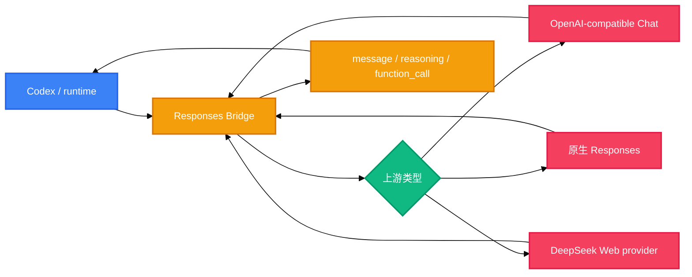

# Codex Responses Bridge

把本地模型、OpenAI-compatible 上游、DeepSeek Web 这类非标准上游，接到 Codex 能理解的 Responses 工作流里。

它不是普通聊天反代。普通反代通常解决“请求能发出去、文本能回来”；这个项目解决“Codex 能不能继续跑工具、续接上下文、理解流式事件，并且不被假能力误导”。

```text
模型负责思考和生成
bridge 负责转换 Responses 状态和工具调用
Codex / runtime 负责真正执行工具
```

## 为什么不是普通接口对齐

| 对比点 | 普通 OpenAI-compatible 反代 | Codex Responses Bridge |
| --- | --- | --- |
| 目标 | 对齐 URL、字段名和模型名 | 对齐 Codex 需要的 Responses 运行机制 |
| 返回内容 | 主要返回 assistant 文本 | 返回 `message`、`reasoning`、`function_call` 等 Codex 可识别 item |
| 工具调用 | 上游不支持工具时基本失效 | 普通文本模型也能通过文本协议表达工具意图 |
| 工具执行 | 代理层容易越界执行工具 | bridge 不执行工具，只把调用交给 Codex/runtime |
| 上下文 | 多由客户端自己拼 messages | 支持 `previous_response_id` 和 conversation 续接 |
| streaming | 逐字吐文本通常就够 | 输出 Responses SSE 事件，包含文本、reasoning、工具参数和完成状态 |
| 元数据 | 容易丢失或随意补字段 | 只透传真上游返回且不破坏本地语义的 metadata |
| 边界 | 容易“看起来兼容” | 不伪造 hosted tools、encrypted reasoning、官方计费语义 |

## 核心能力

| 能力 | 说明 |
| --- | --- |
| Responses 桥接 | 对外提供 `/v1/responses`，维护 response 状态、工具结果和续接上下文 |
| 工具调用转换 | 把模型输出里的工具意图整理成 Codex 可执行的 `function_call` |
| 多入口兼容 | 同时提供 Responses、Chat Completions、Messages 入口 |
| 本地状态 | 支持 responses、conversations、files 的本地存储和读取 |
| 流式事件 | 将上游输出转换成 Codex 能消费的 Responses SSE |
| DeepSeek Web 智能路由 | 默认暴露 `deepseek-web/auto`，内部按请求切到快速、专家、思考、搜索和识图 |
| 共享工作区 | DeepSeek Web 内部按 `conversation`、`previous_response_id`、`prompt_cache_key` 续接 session、vision 结果和路由决策 |
| 元数据透传 | 原生 Responses 上游真实返回时，透传 `usage`、`service_tier`、prompt cache 相关字段 |

## 普通模型和工具模型能做到什么

| 上游类型 | 当前能做到什么 | 边界 |
| --- | --- | --- |
| 普通文本模型 | 普通回答、阅读上下文、按文本协议表达工具调用意图 | 稳定性取决于模型是否按协议输出 |
| OpenAI-compatible Chat 模型 | 通过 `/chat/completions` 接入，再由 bridge 转成 Codex 需要的形态 | 主要靠文本工具协议补齐工具调用 |
| 原生 Responses 上游 | 读取真实 `message`、`reasoning`、`function_call` 和 Responses SSE | 最接近 Codex 原生工作流 |
| 支持工具但输出不稳定的模型 | 优先使用可识别的原生工具输出，不完整时回到文本协议解析 | 仍受上游输出质量影响 |
| 不理解工具的模型 | 可以普通聊天和上下文续接 | 不适合强制工具任务 |

| 能力 | 普通模型 | 原生 Responses / 工具模型 |
| --- | --- | --- |
| 普通回答 | 支持 | 支持 |
| 接入 Codex | 支持 | 支持 |
| 多轮上下文 | 支持 | 支持 |
| 工具调用 | 通过文本协议解析 | 通过原生 `function_call` 更稳 |
| 工具结果回传 | 支持进入下一轮 | 支持进入下一轮 |
| streaming | bridge 整理成 Responses 事件 | 解析并转发原生 Responses 事件 |
| reasoning / answer 分离 | 有可见 reasoning 时保留 | 原生支持时更自然 |
| Structured Outputs | 本地提取和校验 | 本地提取和校验，也可结合上游能力 |
| usage / service tier / prompt cache | 不伪造 | 上游真实返回时透传 |

## 本地模型可以借用哪些能力

本地模型不会直接操作你的电脑。它能做的是判断下一步要不要用工具、要调用哪个工具、参数是什么；真正执行仍由 Codex、MCP 或你的 runtime 完成。

| 能力 | 本地模型得到什么 | 实际执行者 |
| --- | --- | --- |
| 代码库阅读 | 看到 Codex 读取到的文件内容，再继续分析 | Codex |
| 命令结果利用 | 看到终端输出，决定下一步 | Codex |
| 文件/图片输入 | 将文本、图片或工具返回内容带入上下文 | bridge / provider / Codex |
| MCP / 自定义工具 | 生成标准工具调用参数 | Codex / MCP runtime |
| 多轮任务推进 | 在工具结果之间保持任务上下文 | bridge |
| 流式交互 | 输出被整理成 Codex 可消费事件 | bridge |
| 结构化输出 | JSON 输出可被提取和校验 | bridge |

## 快速开始

### 启动默认本地上游

默认配置指向 `http://127.0.0.1:11434/v1`，适合先接 Ollama、LM Studio、vLLM 等 OpenAI-compatible 本地服务。

```bash
cargo run
```

启动后访问：

```text
http://127.0.0.1:8787/ui
```

### 指定上游

```bash
ADAPTER_UPSTREAM_BASE_URL=http://127.0.0.1:11434/v1 \
ADAPTER_UPSTREAM_MODEL=qwen2.5-coder \
ADAPTER_UPSTREAM_WIRE_API=chat_completions \
cargo run
```

### 连接原生 Responses 上游

当上游本身支持 `/v1/responses` 时，将 wire API 切到 `responses`。

```bash
ADAPTER_UPSTREAM_WIRE_API=responses \
cargo run
```

### 使用 DeepSeek Web 智能路由

打开本地配置页，选择 `DeepSeek Web`，登录并捕获 session 后，第三步点击“一键配置 Codex”。外部请求只需要使用一个模型名：

```text
deepseek-web/auto
```

`auto` 会在 provider 内部决定是否需要 vision prepass、专家模式、联网搜索或 thinking 摘要；这些内部步骤不会作为正文吐给外部客户端。

### 健康检查

```bash
curl http://127.0.0.1:8787/health
```

## Codex 配置示意

```toml
model_provider = "ModelToolCallAdapter"
model = "deepseek-web/auto"
review_model = "deepseek-web/auto"
model_reasoning_effort = "xhigh"
disable_response_storage = true
network_access = "enabled"
model_context_window = 1000000
model_auto_compact_token_limit = 900000

[model_providers.ModelToolCallAdapter]
name = "ModelToolCallAdapter"
base_url = "http://127.0.0.1:8787/v1"
wire_api = "responses"
requires_openai_auth = true
```

`~/.codex/auth.json` 里写入 adapter key：

```json
{
  "OPENAI_API_KEY": "adp_xxx"
}
```

推荐通过本地 `/ui` 一键写入。写入前会备份 `~/.codex/config.toml` 和 `~/.codex/auth.json`，Codex 已经运行时需要重启。

## DeepSeek Web 外部用法

外部仍然调用标准 OpenAI-compatible 入口。推荐优先使用 `/v1/responses`，因为它能表达图片、文件、状态续接、工具调用和语义化 streaming 事件。

### Responses streaming

```bash
curl http://127.0.0.1:8787/v1/responses \
  -H 'content-type: application/json' \
  -H 'authorization: Bearer adp_xxx' \
  -d '{
    "model": "deepseek-web/auto",
    "input": "分析当前项目的错误处理和工具调用状态显示",
    "stream": true,
    "prompt_cache_key": "codex-thread-a"
  }'
```

### 图片输入

```json
{
  "model": "deepseek-web/auto",
  "input": [{
    "type": "message",
    "role": "user",
    "content": [
      { "type": "input_text", "text": "看这张截图，判断项目哪里需要改" },
      { "type": "input_image", "image_url": "data:image/png;base64,..." }
    ]
  }],
  "stream": true,
  "prompt_cache_key": "codex-thread-a"
}
```

简单看图会直接由 vision 完成；看图后还要写代码、排错或分析项目时，vision 只做前置解析，最终交给专家模式。

### 状态续接

```json
{
  "model": "deepseek-web/auto",
  "previous_response_id": "resp_xxx",
  "input": "继续刚才的修复，给出下一步"
}
```

也可以使用 `conversation` 或稳定的 `prompt_cache_key` 让 DeepSeek Web provider 复用内部 workspace。

## 配置项

| 变量 | 默认值 | 作用 |
| --- | --- | --- |
| `ADAPTER_BIND` | `127.0.0.1:8787` | 本地监听地址 |
| `ADAPTER_UPSTREAM_BASE_URL` | `http://127.0.0.1:11434/v1` | 上游 OpenAI-compatible 或 Responses 地址 |
| `ADAPTER_UPSTREAM_API_KEY` | 空 | 上游 API key |
| `ADAPTER_UPSTREAM_MODEL` | `local-model` | 默认上游模型名 |
| `ADAPTER_UPSTREAM_WIRE_API` | `chat_completions` | 上游 wire 类型：`chat_completions` 或 `responses` |
| `ADAPTER_MODEL_ALIASES` | 空 | 将 Codex 请求模型映射到真实上游模型 |
| `ADAPTER_API_KEY` | 本地配置自动生成 | bridge 对外鉴权 key |
| `ADAPTER_MAX_TOOL_DEFINITIONS` | `64` | 单次请求允许的最大工具定义数 |
| `ADAPTER_REQUEST_TIMEOUT_SECS` | `120` | 上游请求超时 |

本地持久化路径可以用 `ADAPTER_CONFIG_FILE`、`ADAPTER_RESPONSE_STORE_FILE`、`ADAPTER_CONVERSATION_STORE_FILE`、`ADAPTER_FILES_DIR` 覆盖。

## API 入口

| 入口 | 用途 |
| --- | --- |
| `GET /health` | 健康检查 |
| `GET /ui` | 本地配置页面 |
| `GET /v1/models` | 模型列表和别名展示 |
| `POST /v1/responses` | Codex / Responses 主入口 |
| `GET /v1/responses/{id}` | 读取本地 response 状态 |
| `POST /v1/chat/completions` | Chat Completions 兼容入口 |
| `POST /v1/messages` | Messages 兼容入口 |
| `/v1/conversations/*` | conversation 创建、读取、追加、删除 |
| `/v1/files/*` | 文件上传、读取、删除 |

## 运行链路



## 项目结构

```text
src/
├── main.rs                 # 进程入口，加载配置并启动 HTTP 服务
├── config.rs               # 命令行参数、环境变量、本地配置文件
├── http/                   # Axum 路由和 Responses/Chat/Messages 处理
├── wire/                   # 外部 API 形态到统一请求的转换
├── providers/              # OpenAI-compatible 与 DeepSeek Web 上游
├── protocol/               # 模型文本工具协议解析
├── responses_store.rs      # response 本地状态
├── conversations_store.rs  # conversation 本地状态
├── files_store.rs          # files 本地状态
├── structured_outputs.rs   # Structured Outputs 提取和校验
└── upstream.rs             # 上游响应归一化和 metadata 透传边界
docs/
└── RESPONSES_MECHANISM.zh-CN.md
```

## 技术栈

| 层 | 技术 | 用途 |
| --- | --- | --- |
| 语言 | Rust 2021 | 主服务实现 |
| HTTP 服务 | Axum 0.7 / Tokio | 本地 API 服务和异步运行时 |
| 上游请求 | reqwest | 调用 OpenAI-compatible、Responses 或 provider 上游 |
| 数据格式 | serde / serde_json | 请求、响应和本地状态序列化 |
| Schema 校验 | jsonschema | Structured Outputs 校验 |
| CLI / 配置 | clap | 环境变量和命令行参数 |
| 可选前端 | Next.js / React | `frontend/` 下的本地配置界面 |

## 元数据边界

| 字段类型 | 处理方式 |
| --- | --- |
| `usage` | 只在上游真实返回时透传，包括 prompt cache 命中细节 |
| `service_tier` | 只透传真上游值 |
| `prompt_cache_key` / `prompt_cache_retention` | 有真实返回时保留，不自行伪造缓存效果 |
| `metadata` / `client_metadata` | 不破坏本地 response 语义时透传 |
| response `id` / `status` / `output` | 使用 bridge 本地状态，不让上游覆盖 |
| hosted tools / encrypted reasoning | 没有真实来源时不伪造 |

## 适合和不适合

| 适合 | 不适合 |
| --- | --- |
| 让 Codex 使用本地模型或自建模型代理 | 只想做简单聊天反代 |
| 把 Ollama、vLLM、LM Studio 等接进 Codex | 想让 bridge 代替 Codex 执行 shell、浏览器或业务工具 |
| 上游工具调用不稳定，但希望仍能跑工具循环 | 想伪装成完整 OpenAI 官方 Responses 服务 |
| 需要 Responses 状态、streaming、工具结果续接 | 需要多实例共享强一致状态 |

## 当前状态

项目正在从旧名 `model-toolcall-adapter-rs` 过渡到 `codex-responses-bridge`。当前 README 先按新定位整理；crate 名、配置目录、历史文档等正式改名项后续再收口。

更细的机制说明见 [docs/RESPONSES_MECHANISM.zh-CN.md](docs/RESPONSES_MECHANISM.zh-CN.md)。

`Cargo.toml` 当前声明 `license = "MIT"`；仓库根目录尚未包含独立 `LICENSE` 文件。
